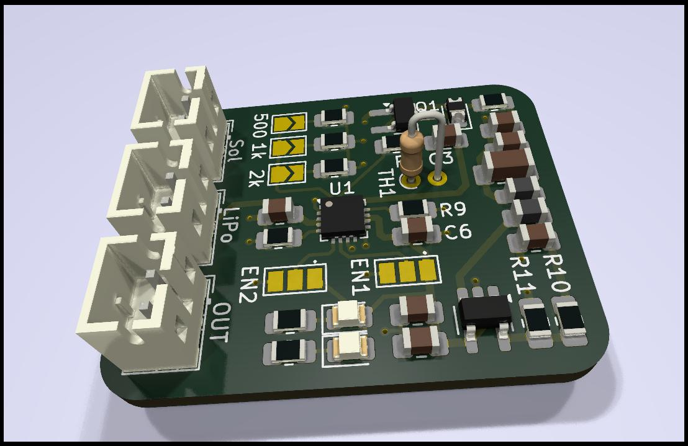

# Description

A small TI BQ24074 solar charger inspired by the Adafruit design with some modifications:

 - Protection diode replaced with a PMOS to get rid of the diode voltage drop
 - Added a M3406-ADJ to get clean 3.3V
 - Big Cs to catch transients
 - Filter to get rid of most of the ripple caused by the buck

# Important

Thermistor TH1 must *always* be soldered. 

If you don't want to use one: solder a 10k 0805 resistor.

# Configuration

| **OUT Voltage** | **R10** | **R11** |
|---------|-------------|---------|
| 1.8V    |  Todo       | Todo    |
| 3.3V    |  Todo       | Todo    |

| **Charging current max.**   | **EN1** | **EN2** |
|-------------|----------|---------|
|  500mA |   Dot    |  No Dot |
|  100mA |   No Dot |  No Dot |

# Most important datasheets

[TI BQ24074](https://www.ti.com/lit/gpn/bq24074)

[XI'AN Aerosemi Tech M3406-ADJ](https://www.lcsc.com/datasheet/lcsc_datasheet_2304140030_XI-AN-Aerosemi-Tech-M3406-ADJ_C83224.pdf)
